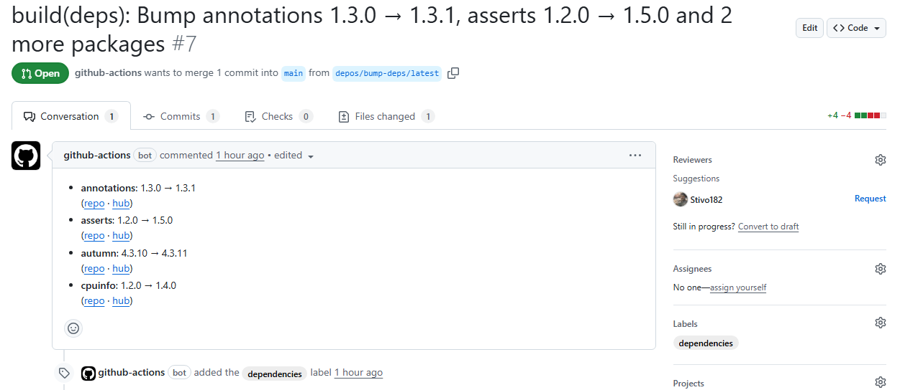

# Depos Action

GitHub Action для обновления зависимостей пакетов OneScript в файле _packagedef_ с помощью утилиты [depos](https://github.com/Stivo182/depos), а также автоматического создания Pull Request.

## Использование

```yaml
- name: Обновление зависимостей
  uses: Stivo182/depos-action@v1
```

### Входные параметры

| Параметр | Описание | Значение по умолчанию |
| --- | --- | --- |
| `filter`         | Фильтр пакетов по именам (через запятую или пробел), шаблону (`*`, `?`) или регулярному выражению.   | |
| `target`         | Тип целевой версии: <br>- `latest` - последняя доступная версия пакета.<br>- `minor` - последняя минорная или патч-версия в пределах основной версии.<br>- `patch` - последняя патч-версия в пределах минорной версии. | `latest` |
| `message-prefix` | Префикс для сообщения коммита и заголовка Pull Request. | |
| `token`          | Токен для создания Pull Request. | `GITHUB_TOKEN` |

**Настройка прав для** `GITHUB_TOKEN`

Для корректной работы при использовании встроенного `GITHUB_TOKEN` необходимо выдать дополнительные разрешения:

1. В настройках репозитория разрешить Actions создавать PR: </br>
**Settings → Actions → General → Workflow permissions** → установить флажок
**Allow GitHub Actions to create and approve pull requests**. 
2. В workflow явно указать права доступа:

```yaml
permissions:
  contents: write
  pull-requests: write
```

> [!IMPORTANT]  
> Встроенный GITHUB_TOKEN не запускает события on: push и on: pull_request в других workflows при создании коммитов или pull request'ов. Чтобы автоматически запускать эти события, необходимо использовать **Personal Access Token** и передать его в параметр `token`.

### Пример использования

```yaml
name: Еженедельное обновление зависимостей

on:
  schedule:
    - cron: '0 0 * * 1' # Каждый понедельник
  workflow_dispatch:

jobs:
  update-dependencies:
    runs-on: ubuntu-latest
    steps:
      - name: Обновление зависимостей
        uses: Stivo182/depos-action@v1
        with:
          filter: autumn-* # Обновлять только пакеты autumn
          target: minor    # До минорных версий
          message-prefix: build(deps)
          token: ${{ secrets.PAT }}
```

Пример автоматически созданного Pull Request:

