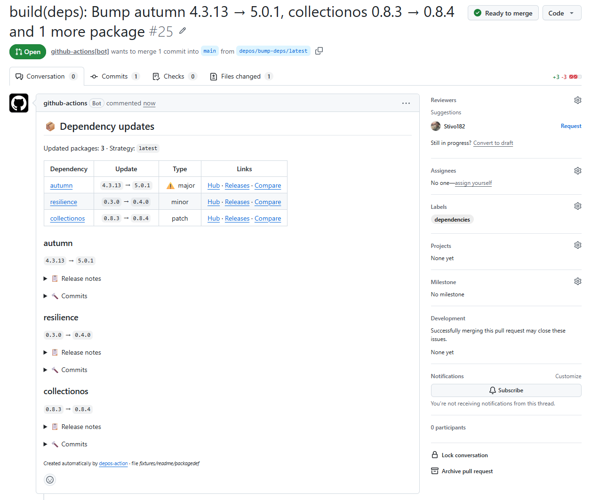

# Depos Action

GitHub Action для автоматического обновления зависимостей OneScript в файле `packagedef` с помощью
[`depos`](https://github.com/Stivo182/depos). Action обновляет `packagedef` и создаёт или актуализирует
Pull Request с описанием изменений. Когда обновлений больше нет, управляемый Pull Request автоматически закрывается.

## Возможности

- обновление всех зависимостей или выбранных пакетов по стратегиям `latest`, `minor` и `patch`;
- создание и повторное использование одного Pull Request;
- дополнение Pull Request сведениями о релизах, changelog и коммитах;
- автоматическое закрытие управляемого Pull Request, когда обновлений больше нет;
- отдельная ветка обновлений для каждой базовой ветки и стратегии.

## Быстрый старт

Создайте workflow, например `.github/workflows/update-dependencies.yml`:

```yaml
name: Обновление зависимостей

on:
  schedule:
    - cron: '0 0 * * 1'
  workflow_dispatch:

permissions:
  contents: write
  pull-requests: write

jobs:
  update-dependencies:
    runs-on: ubuntu-latest
    steps:
      - name: Обновление зависимостей
        uses: Stivo182/depos-action@v1
        with:
          target: minor
```

Этот workflow проверяет зависимости каждый понедельник и также может быть запущен вручную.

## Входные параметры

| Параметр | Описание | Значение по умолчанию |
|---|---|---|
| `packagedef` | Относительный путь к файлу `packagedef` или содержащему его каталогу внутри репозитория | `packagedef` |
| `filter` | Фильтр в формате `depos`: имена пакетов, маска (`*`, `?`) или регулярное выражение | Все пакеты |
| `target` | Стратегия обновления: `latest`, `minor` или `patch` | `latest` |
| `depos-version` | Версия `depos`, устанавливаемая через `opm` | Закреплённая версия Action из [`.depos-version`](.depos-version) |
| `base` | Базовая ветка Pull Request | Ветка репозитория по умолчанию |
| `message-prefix` | Префикс сообщения коммита и заголовка Pull Request | `build(deps)` |
| `branch` | Имя ветки Pull Request | Формируется автоматически |
| `labels` | Метки Pull Request через запятую или перевод строки | `dependencies` |
| `token` | Токен для GitHub API и Pull Request | `GITHUB_TOKEN` текущего workflow |

Пример обновления только выбранных пакетов до последних patch-версий:

```yaml
- name: Обновление зависимостей
  uses: Stivo182/depos-action@v1
  with:
    filter: autumn, semver
    target: patch
```

## Права и токен

По умолчанию используется встроенный `GITHUB_TOKEN`. Разрешите Action изменять содержимое репозитория и
работать с Pull Request:

```yaml
permissions:
  contents: write
  pull-requests: write
```

Также включите создание Pull Request в настройках репозитория:
**Settings → Actions → General → Workflow permissions → Allow GitHub Actions to create and approve pull requests**.

Для событий `pull_request` типов `opened`, `synchronize` и `reopened`, инициированных с помощью `GITHUB_TOKEN`,
создаются запуски workflows. Эти запуски ожидают ручного одобрения пользователя с правом записи. Другие типы
событий `pull_request`, например `edited`, `labeled` и `closed`, запусков не создают.
Большинство остальных событий, инициированных `GITHUB_TOKEN`, включая `push`, также не запускают новые workflows.
Если проверки Pull Request должны запускаться без этого ограничения, используйте Personal Access Token или
токен GitHub App. Другие политики репозитория при этом продолжают действовать. Подробнее — в
[документации GitHub](https://docs.github.com/en/actions/how-tos/write-workflows/choose-when-workflows-run/trigger-a-workflow).

```yaml
permissions:
  contents: read

jobs:
  update-dependencies:
    runs-on: ubuntu-latest
    steps:
      - name: Обновление зависимостей
        uses: Stivo182/depos-action@v1
        with:
          token: ${{ secrets.PAT }}
```

Право `contents: read` предоставляется встроенному `GITHUB_TOKEN` и необходимо для `actions/checkout`.
Создание ветки и Pull Request выполняется с помощью переданного PAT.

Для fine-grained PAT нужны разрешения **Contents: Read and write** и
**Pull requests: Read and write** на целевой репозиторий. Для classic PAT требуется scope `repo`.
Не сохраняйте токен непосредственно в workflow или других файлах репозитория.

## Как работает Action

1. Определяет базовую ветку и путь к `packagedef`.
2. Запускает `depos` с выбранными `filter` и `target`.
3. Если файл изменился, собирает доступные сведения о релизах и коммитах через GitHub API.
4. Создаёт новый Pull Request либо обновляет ранее созданный для той же пары `base` и `branch`.
5. Если изменений нет, закрывает ранее созданный им Pull Request и удаляет его служебную ветку.

В Pull Request добавляется только выбранный файл `packagedef`; он должен находиться под контролем Git.

Сведения о релизах и коммитах собираются в режиме best effort. Если метаданные отдельной зависимости недоступны,
описание Pull Request формируется без соответствующих ссылок, release notes или коммитов.

Описание Pull Request содержит:

- сводную таблицу зависимостей с диапазоном версий и типом обновления;
- ссылку на пакет в OneScript Package Hub;
- ссылки на Releases и Compare, когда соответствующие данные доступны;
- release notes версий из обновляемого диапазона;
- содержимое `CHANGELOG.md` из целевого тега, если файл доступен;
- до десяти последних коммитов и ссылку на полное сравнение.

## Ветки и повторные запуски

Для основной ветки имя рабочей ветки формируется как `depos/bump-deps/<target>`. Для другой базовой ветки
добавляется её имя: `depos/bump-deps/<target>/<base>`.

Повторные запуски с одинаковыми `base` и `branch` обновляют существующий Pull Request. Если в одном репозитории
настроено несколько независимых обновлений с одинаковыми `base` и `target`, задайте каждой конфигурации
уникальное значение `branch`.

Pull Request без служебного маркера `depos-action` автоматически не закрывается. Ветка, явно заданная через
`branch`, без управляемого Pull Request не удаляется. Автоматически сформированная служебная ветка может быть
удалена, если соответствующего Pull Request больше нет.

## Пример Pull Request


